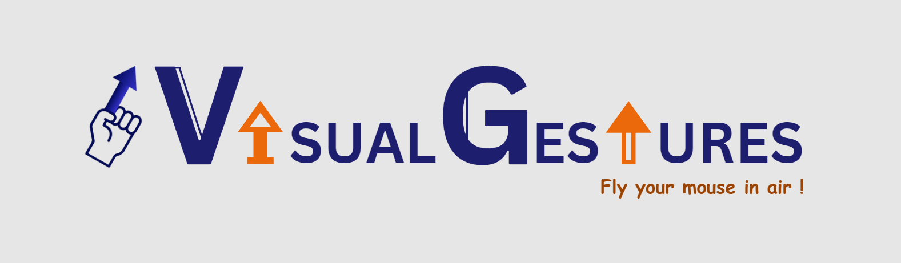

# VisualGestures.js

VisualGestures.js is an open-source TypeScript package that empowers users to effortlessly control the cursor, including actions such as hover, click, drag, and drop, through precise finger movements in the air.
<br><br>
**Immersive and Engaging User Experience** <br>
Offers a unique and engaging user experience, often perceived as more immersive, and touch-free compared to conventional interfaces, particularly appealing for applications in gaming, virtual reality, and creative industries.
<br><br>
**Offline Support** <br>
Developed in TypeScript, works anywhere with full offline functionality without the continuous requirement of internet, making it remotely available
<br><br>
**Customizable for Various Applications** <br>
Tailored for different industries such as controlling machinery in factories, navigating interfaces in automotive displays, interacting with public information kiosks without touching a screen.
<br><br>
<a href="https://github.com/user-attachments/assets/a24cc183-36cd-42a9-9910-b8405c45327f"> Click here </a> to watch demo of how it works!
<br>

## Table of Contents</h2>

- [Getting Started](#getting-started)
- [Comprehensive Ecosystem](#comprehensive-ecosystem)
- [Compatibility](#compatibility)
- [Contribute](#contribute)
- [Support](#support)
- [Maintainers](#maintainers)
- [Citation](#citation)

## Getting Started

**1. Install our npm package**

>  ```javascript
>  npm install @learn-hunger/visual-gestures
>  ```

**2. Integrate into your existing website**

>  ```javascript
>  import { VisualGestures } from "@learn-hunger/visual-gestures/dist/";
>
>  /**
>   *create instance of visual-gestures
>   *which accepts optional parameters of container and the landmark to be used as pointer
>   *[Default body and landmark 8 is used respectively]
>   */
>  const vg = new VisualGestures();
>
>  // get hand landmarks from mediapipe's taskvision
>  // here video corresponds to 'HTMLVideoElement' with live webcam stream
>  const landmarks = handDetector.detectForVideo(video, performance.now());
>  vg.detect(landmarks.landmarks[0], performance.now());
>  // Virtual cursor can be seen once model loading and detection started successfully
>  ```

For more information about handDetector, refer to the <a href="https://www.npmjs.com/package/@mediapipe/tasks-vision">mediapipe handLandmarker</a> documentation.<br/><br/>
**3. Available Events** <br/>
One can find a quick guide below on how to use the gestures
<br/>
>  ```javascript
>  // one can find all possible event types in EVgMouseEvents
>  import { EVgMouseEvents } from "@learn-hunger/visual-gestures/dist/app/utilities/vg-constants";
>
>  // currently offered cursor control events
>  vgPointerMove();  // corresponds to 'onmousemove'
>  vgPointerEnter(); // corresponds to 'onmouseenter'
>  vgPointerLeave(); // corresponds to 'onmouseleave'
>  vgPointerDown(); // corresponds to 'onmousedown'
>  vgPointerUp(); // corresponds to 'onmouseup'
>  vgPointerClick(); // corresponds to 'onclick'
>  vgPointerDrag(); // corresponds to 'onmousedrag' ('onclick'+'onmousemove')
>  vgPointerDrop(); // corresponds to 'onmousedrop' ('onclick'+'onmousemove'+'onmouseup')
>  ```

##### For each event, you can use a callback on the vgInstance[3.1] or via traditional event listeners [3.2], similar to cursor-based controls.

**3.1. Instance Based Listening** <br>

Function corresponds to 'onmousemove' event in traditional cursor-based controls

>  ```javascript
>  vg.mouseEvents.onPointerMove = () => {
>    // console.log("callback pointer moved");
>  };
>  ```

**3.2. Traditional Event Based Listening** <br>

Function corresponds to 'onmousemove' event in traditional cursor-based controls

>  ```javascript
>  import { EVgMouseEvents } from "@learn-hunger/visual-gestures/dist/app/utilities/vg-constants";
>  document.addEventListener(EVgMouseEvents.MOUSE_MOVE, () => {
>    // console.log("callback pointer moved");
>  });
>  ```
<br/>

#### Similarily MOUSE_ENTER, MOUSE_LEAVE, MOUSE_DOWN, MOUSE_UP, MOUSE_CLICK, MOUSE_DRAG, MOUSE_DROP events can be listened via instance based or traditional based listening.

## Comprehensive Ecosystem

Our custom-built project seamlessly integrates tools like [Central Logger](https://analytics.google.com/analytics/web/#/p458601436/reports/reportinghub?params=_u..nav%3Dmaui),
Vercel auto build, [GitHub release management](https://github.com/learn-hunger/visual-gestures/releases), 
[debugging tools](https://visual-gestures.vercel.app/#debug), 
[CI/CD pipelines](https://drive.google.com/file/d/1Yd7y5yqpNi6e2v3zJWHMRDf_dzPzTCIo/view?usp=sharing), and 
[automated code reviews](https://drive.google.com/file/d/1gsiI8DUTc3D_zSQNSCXAayqNUmVfnug7/view?usp=sharing),
providing developers with the flexibility and performance needed to innovate and contribute effortlessly.

<br/>
## Compatibility

**Desktop Platforms**
|OS/Browser|Chrome|Edge|FireFox|Safari|Opera|
|:---:|:---:|:---:|:---:|:---:|:---:|
|Windows| ✔️| ✔️ | ✔️ | ✔️| ✔️ |
|macOS| ✔️| ✔️ | ✔️ | ✔️| ✔️ | 
|Ubuntu LTS 18.04| ✔️| ✔️ | ✔️ | ✔️| ✔️ |

**Mobile platforms**
|OS/Browser|Chrome|Edge|FireFox|Safari|Opera
|:---:|:---:|:---:|:---:|:---:|:---:|
|iOS| ✔️| ✔️ | ✔️ | ✔️| ✔️ |
|Android| ✔️| ✔️ | ✔️ | ✔️| ✔️ |

## Contribute

We'd love to embrace your contribution to VisualGestures.js. Please refer to <a href="https://github.com/learn-hunger/visual-gesture-events/blob/main/CONTRIBUTING.md">CONTRIBUTING.md</a>
<br><br>
⭐ [Starring the repository](https://github.com/learn-hunger/visual-gesture-events) to show your appreciation. <br>
🐛 [Reporting bugs](https://github.com/learn-hunger/visual-gesture-events/issues) and suggesting improvements by opening issues. <br>
🔥 [Contributing](https://github.com/learn-hunger/visual-gesture-events/blob/main/CONTRIBUTING.md) to the development by submitting pull requests. <br>

## Support

We greatly appreciate your support in making <b>VisualGestures</b> even better!
<br> <br>
🌍 Sharing the project with your community to help spread the word. <br>
💼 If you're interested in [sponsoring](https://github.com/sponsors/learn-hunger) our work, we would love your support! Your sponsorship will help us continue innovating and delivering high-quality updates. Please reach out to us directly for more information. <br><br>
Your kind [feedback](https://github.com/learn-hunger/visual-gesture-events/issues), [contributions](https://github.com/learn-hunger/visual-gesture-events/blob/main/CONTRIBUTING.md), and [sponsorships](https://github.com/sponsors/learn-hunger) are invaluable in helping us continue to improve and grow this project!

## Maintainers

<a href="https://www.linkedin.com/in/nagendra-dharmireddi-27a4651b1/">Nagendra Dharmireddi</a>& <a href= "https://www.linkedin.com/in/boddusripavan/"> Boddu Sri Pavan </a><br/>
Join our [Discord community](https://discord.gg/czWwQjBW) to engage with us directly, and don't forget to follow us on LinkedIn and [GitHub](https://github.com/learn-hunger) to stay updated on our latest projects, collaborations, and innovations!

## Citation

> @software{ <br/>
> package = {@learn-hunger/visual-gestures}, <br/>
> authors = {Nagendra Dharmireddi& Boddu Sri Pavan}, <br/>
> title = {{visual-gestures}}, <br/>
> year = {2024}, <br/>
> version = {0.0.1}, <br/>
> url = {https://github.com/learn-hunger/visual-gestures}, <br/>
> howpublished = {\url{https://www.npmjs.com/package/@learn-hunger/visual-gestures}} <br/>
> }

## Thank You !
