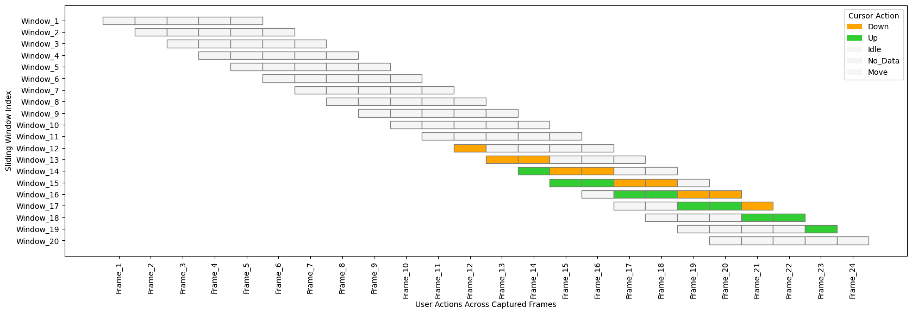
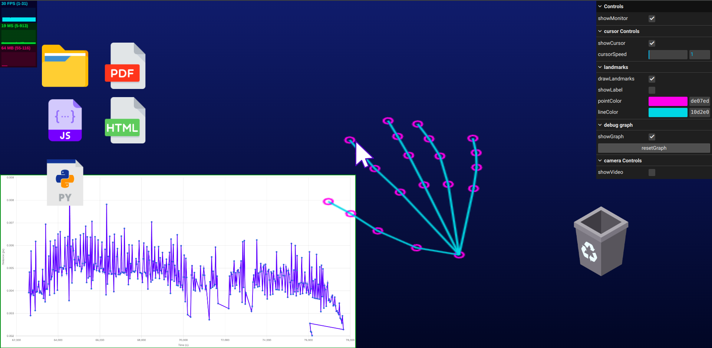

# Summary

**visual-gestures.js** is an open-source TypeScript library enabling precise
cursor control hover, click, drag, and drop through hand gestures in the air.
It replaces traditional touch-based interactions with intuitive, 
natural gestures, offering seamless performance, offline support, and 
uninterrupted productivity. Designed with an event-driven architecture, it is 
highly extensible across diverse applications. The library is open-source and 
available on GitHub \: https://github.com/learn-hunger/visual-gestures

# Statement of need

Traditional cursor control relies on touch-based interaction, requiring 
physical contact with a device. While libraries such as MediaPipe @50649 @mediapipe @mediapipe-hand-landmarker 
and OpenCV @opencv_library provide accurate hand landmarks, they leave developers with raw coordinate data. 
Turning these into usable interactions still requires custom rule-based logic and event handling.

visual-gestures.js fills this gap by:
- Performing the rule-based classification of landmarks into gestures like click, drag, and hover.
- Exposing these gestures through an API that mimics native browser pointer events (pointerMove, pointerDown, pointerUp),
  making integration seamless.
- Providing customizable gesture definitions with adjustable landmarks, thresholds, and motion rules, combined with lightweight
  client-side formulas for smoothing and robust detection, optimized for real-time use in the browser.
- Enabling touchless websites and WebXR prototypes using only a webcam, without servers or proprietary SDKs.

This combination of rule-based classification and event abstraction makes visual-gestures.js a practical, 
ready-to-use toolkit in websites that complements, rather than duplicates, existing hand-tracking frameworks.

# Proposed Methodology

We introduce pseudo events, gesture-based equivalents of traditional 
cursor events, enabling seamless human-computer interaction without 
physical touch. Gesture recognition is achieved by extracting hand landmarks 
using Google MediaPipe's Hand Landmarker @50649 @mediapipe @mediapipe-hand-landmarker.

At the core of our approach is the Fluid Kink Ratio Algorithm (FKR Algorithm), 
a novel technique, we propose, for gesture-based decision-making. FKR Algorithm dynamically tracks 
the ratio of two key segment lengths: (i) Index fingertip to its base and 
(ii) Index finger base to wrist base. This ratio is monitored within a 
hibernating sliding window of the last five recorded frames, ensuring 
smooth tracking and reducing transient noise.

Instead of conventional Euclidean distance, we utilize 
Weighted Euclidean distance, which assigns greater importance to the y-axis 
component, enhancing vertical gesture sensitivity.  
$$\text{Weighted Euclidean Distance}= 
\sqrt{\alpha(x_1-x_2)^2 + \beta(y_1-y_2)^2} $$
$$where \text{ } \alpha,\text{ }\beta \in [0,1]$$

Figure 1, 2  illustrate the sequential gesture transitions within the
sliding window, visualized using KitikiPlot @boddu_sri_pavan_2025_14632005 depicting movement trends across 
consecutive time frames.

*Figure 1: Visualization of user action sequences using KitikiPlot where 
the x-axis represents user action detected for each frame, and the y-axis 
consecutive sliding windows of length 5, stride 1, where distinct colors 
represent different events, enabling clear identification 
and differentiation of user interactions during 
gesture-based operations.*

*Figure 2: Sliding window visualization focusing specifically on cursor up 
and down events, where the x-axis represents user action detected for 
each frame, and the y-axis consecutive sliding windows of length 5, 
highlighting the frame-level sequential relationship within the 
user gesture actions.*

We developed a robust debugging panel, as shown in Figure 3 featuring memory and 
CPU utilization tracking, framerate monitoring, landmark skeletal 
visualization @visualise-data-kit , a live finger kink ratio graph, and a customizable debug UI. 
This enables developers to extend and tailor the system to their specific 
use cases efficiently.

*Figure 3: Comprehensive Debugging Panel*

# Acknowledgements

We express our heartfelt gratitude to our parents and family members for 
their unwavering support. This work is conducted with the gracious blessings of 
Paramatma.

# References
